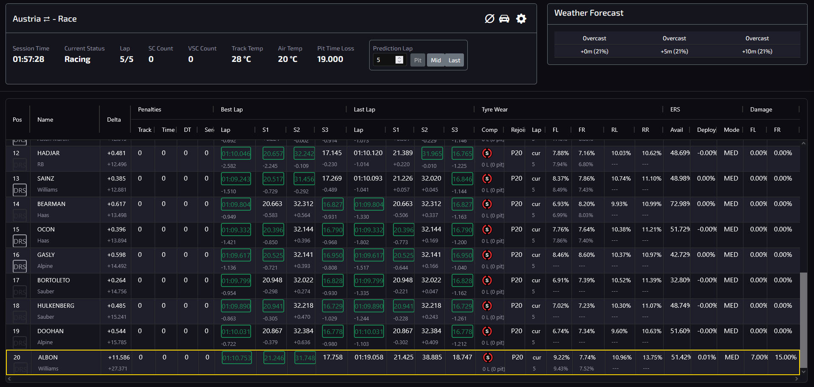

# Pits N' Giggles - Integrated Race Strategy Center

This repository contains the full integration suite to connect the **Pits N' Giggles** telemetry application with the **Model Context Protocol (MCP)** and provide a unified **Race Strategy Dashboard**.




## 🚀 Overview

The integration transforms the local telemetry tool into a professional racing suite by:
1.  **Providing a Secure Reverse Proxy**: Using Nginx to terminate TLS via an internal CA, allowing ChatGPT and other AI models to connect via HTTPS.
2.  **TLS from your CA:** Request server certificates for `f1-race-engineer.netintegrate.net` via **https://ca.netintegrate.net/docs** (see [deployment README — Manual setup](deployment/README.md#manual-setup)). Self-signed is optional for `localhost` only.
3.  **Unified AI Strategy Dashboard**: A premium 2-pane web interface where you can view live telemetry alongside a specialized **Antigravity Race Engineer** AI agent.


## 📂 Repository Structure

-   `pitsngiggles-mcp.conf`: The Nginx configuration for the secure proxy and dashboard.
-   `strategy_center.html`: The premium integrated dashboard (served at `https://f1-race-engineer.netintegrate.net:8443/`).
-   `launch_race_center.ps1`: One-click launcher for the entire suite.
-   `start_mcp.ps1`: Simplified telemetry app starter.
-   `start_engineer_voice.ps1`: **LAN race engineer** (Ollama on this PC + live telemetry; see below).
-   `docs/AI_CLIENT_SETUP.md`: Guide for connecting Cursor, ChatGPT, etc.
-   `docs/CONSOLE_VOICE.md`: Why Xbox + PC audio is split; engineer voice is on the **PC**.
-   `docs/PYTHON_ENVIRONMENT.md`: **Poetry** (official) vs optional **uv**/venv, `package-mode`, and the separate **`engineer_voice`** venv.
-   `docs/BUILDING.md` / `docs/RUNNING.md`: PyInstaller build and running the app with **`poetry run`**.

## 🐍 Python, Poetry, and building

- The **Pits n’ Giggles** application and Windows executable build are documented with **[Poetry](https://python-poetry.org/)** (`poetry install`, `poetry run …`). The repo is **not** a “uv-only” setup; `uv` or a manual venv is an optional alternative—see **[docs/PYTHON_ENVIRONMENT.md](docs/PYTHON_ENVIRONMENT.md)**.
- The **LAN race engineer** UI is **mounted inside the main Pits n’ Giggles HTTP server** at **`/race-engineer/`** (same port as telemetry, usually **4768**). Optional **standalone** dev server on **11734** is still available with `$env:RACE_ENGINEER_STANDALONE = "1"` when running `launch_race_center.ps1` / `start_engineer_voice.ps1`. Optional **faster-whisper** STT can be installed into the **same** Poetry/venv you use for the app (`pip install -r engineer_voice/requirements-optional-stt.txt`) or a separate `engineer_voice\.venv` for legacy flows.

## 🎙️ LAN race engineer (Windows PC: Ollama + telemetry, Xbox feeds UDP only)

The **game runs on Xbox**; **Pits n' Giggles** on the **Windows PC** receives UDP telemetry. This repo adds a **local** Ollama-backed UI with **`/race-info` + `/telemetry-info`** in the system prompt—no cloud LLM. Voice I/O is on the **PC** (headset). See `docs/CONSOLE_VOICE.md` for why “audio through the console only” is a separate path.

1. **Install and run [Ollama](https://ollama.com/)** on the PC, e.g. `ollama pull llama3.1:8b` (set `OLLAMA_MODEL` if you use another tag).
2. **Start Pits n' Giggles** so the HTTP server is up (default **4768**).
3. **Open the unified page** (same app as telemetry): **`http://127.0.0.1:<port>/race-engineer/`** — the app auto-opens this when the engineer module mounts, or run **`.\start_engineer_voice.ps1`** from the repo root to open it in your browser (requires PNG already running). From `engineer_voice\`, **`.\start_engineer_voice.ps1`** is a thin wrapper to the root script.
4. **Optional: local STT** (faster transcribe, no browser): install into the **app’s** Python environment, e.g. `poetry run pip install -r engineer_voice/requirements-optional-stt.txt` (or your venv’s `pip`). **ffmpeg** in `PATH` helps for **webm** clips. If STT is off, the page falls back to **Web Speech API** for dictation.
5. **Env overrides:** `OLLAMA_BASE`, `PNG_BASE` (set automatically when mounted; override if needed), `OLLAMA_MODEL`, `ENGINEER_VOICE_PORT` (standalone only, default **11734**). Disable in-process mount: **`RACE_ENGINEER_DISABLE_MOUNT=1`**.

## 🛠️ Quick Setup (WSL / Ubuntu)

### 1. Nginx Deployment
Copy the config to your Nginx sites-available and enable it:
```bash
sudo cp pitsngiggles-mcp.conf /etc/nginx/sites-available/
sudo ln -s /etc/nginx/sites-available/pitsngiggles-mcp.conf /etc/nginx/sites-enabled/
```

### 2. Dashboard Deployment
Move the strategy center to the local web root:
```bash
sudo mkdir -p /var/www/html
sudo cp strategy_center.html /var/www/html/index.html
```

## 🌐 DNS for `f1-race-engineer.netintegrate.net`

In this lab, **`netintegrate.net` is a local zone**, not public registrar DNS. Authoritative resolvers live on the LAN (for example **`192.168.0.252`** and **`192.168.0.253`**).

### Internal DNS (typical for this repo)

1. **Zone on your DNS servers:** define **`f1-race-engineer.netintegrate.net`** as an **A** record to the **IPv4 LAN address** of the machine where Nginx listens on **80** and **8443**.
2. **Clients must query those resolvers:** every PC, phone, or AI tool host that should open `https://f1-race-engineer.netintegrate.net:8443/` needs **DHCP-provided DNS** = `192.168.0.252` / `192.168.0.253`, or a manual static DNS entry on that interface. If Windows still uses only your ISP’s DNS, **`f1-race-engineer.netintegrate.net` will not resolve** (or will NXDOMAIN), and the browser cannot connect.
3. **Issue a server cert for Nginx:** follow **[https://ca.netintegrate.net/docs](https://ca.netintegrate.net/docs)** to create or submit a CSR, obtain the signed **full chain** and **private key**, and install them on the Nginx host (see [deployment README — Manual setup (ca.netintegrate.net)](deployment/README.md#manual-setup)).
4. **Trust your internal CA** on every client: import the org **root** (or issuing) CA so TLS verifies without warnings (or accept the risk once in the browser for dev only).
5. **TLS paths** on the Nginx host must match `pitsngiggles-mcp.conf` and `deployment/nginx/…` (`fullchain.pem` / `privkey.pem` under `/etc/nginx/ssl/f1-race-engineer.netintegrate.net/` by default). Wrong or missing files often produce **ERR_CONNECTION_RESET** or certificate warnings.
6. **Firewall:** allow **TCP 80** and **TCP 8443** to Nginx on that host from other LAN clients (and from the same host for loopback tests).
7. **Upstream** (`proxy_pass … :4768`): see comments in `pitsngiggles-mcp.conf`—fix **WSL2 → Windows** gateway IP when it changes, or use **`127.0.0.1`** if the telemetry app runs on the same Linux instance as Nginx.
8. **Check:** from a client using your internal DNS: `nslookup f1-race-engineer.netintegrate.net 192.168.0.252` then `curl -vkI https://f1-race-engineer.netintegrate.net:8443/`.

### Browser shows `ERR_CONNECTION_RESET` but `curl` works on the server

- **Run the same curl on the PC where the browser fails** (not only on the Nginx box). If curl fails there, it is network/DNS/firewall, not “Edge vs Chrome.”
- **Browser DNS bypass:** Chrome/Edge **Secure DNS / DNS over HTTPS** can ignore Windows DNS (`192.168.0.252` / `192.168.0.253`) and never see your internal zone. Turn off secure DNS for that profile, or choose **“Use your current service provider”**, then retry.
- **Confirm resolution on that PC:** `nslookup f1-race-engineer.netintegrate.net 192.168.0.252` must return the **LAN IP of the Nginx host** (same address curl uses).
- **Firewall on the Nginx host:** allow inbound **TCP 8443** (and **80** if you use the HTTP→HTTPS redirect) from **other LAN clients**, not only from `127.0.0.1`.
- **While reproducing in the browser**, tail Nginx errors: `sudo tail -f /var/log/nginx/pitsngiggles-mcp.error.log` — if the log stays empty on reset, packets are not reaching Nginx (firewall/router path).

### Edge: `curl` works on the same PC, but Edge shows `ERR_CONNECTION_RESET`

Edge (Chromium) negotiates **HTTP/3 (QUIC)** and TLS extensions differently than a command-line **`curl.exe`** fetch. In **PowerShell 7+**, `curl` is an alias for **`Invoke-WebRequest`**, not the real curl—always test with **`curl.exe -vkI …`** when comparing behavior.

1. **Compare trust:** run `curl -vI https://f1-race-engineer.netintegrate.net:8443/` **without** `-k`. If that fails certificate verification but **with** `-k` it works, install your **internal root CA** into **Local Computer** trusted roots (`certlm.msc` → *Trusted Root Certification Authorities* → *Certificates* → import). Edge may not treat a user-only import the same way `curl -k` does.
2. **Disable QUIC in Edge:** open `edge://flags`, search **Experimental QUIC protocol**, set to **Disabled**, restart Edge. QUIC uses **UDP** to the same host; broken or filtered UDP can produce resets while **TCP 443/8443 + TLS** (what `curl` uses) still works.
3. **Secure DNS:** Settings → **Privacy, search, and services** → **Security** → use **your current service provider** (not a fixed public resolver) so internal names resolve like `nslookup` does.
4. **Try Google Chrome** on the same PC. If Chrome works and Edge does not, keep QUIC disabled or reset Edge (Settings → Reset settings).
5. **Narrow TLS:** on the Nginx host, temporarily set `ssl_protocols TLSv1.2;` (TLS 1.2 only), `nginx -t && reload`, test Edge again. If that fixes it, note your OpenSSL/nginx build and consider a TLS 1.3 cipher profile update; then restore `TLSv1.2 TLSv1.3` once fixed upstream.
6. **Third‑party HTTPS inspection** (some antivirus): pause web/HTTPS scanning for a quick test; these tools often break Edge before they break `curl`.
7. **WinHTTP / system proxy:** run `netsh winhttp show proxy`. If traffic is sent to a corporate proxy, Edge can RST while `curl` does not (curl often bypasses WinHTTP). Clear the proxy for testing, or add a bypass for `192.168.0.0/16` and internal hostnames.
8. **HSTS cache:** in Edge open `edge://net-internals/#hsts` → *Delete domain security policies* → enter `f1-race-engineer.netintegrate.net` (stale HSTS from an old cert/host can confuse the browser).
9. **PowerShell `Invoke-WebRequest` and Schannel:** .NET often uses **Windows Schannel** (same family as parts of Edge), not the same stack as **`curl.exe`**. Before `Invoke-WebRequest`, force TLS 1.2+ (older defaults cause “forcibly closed” against nginx `TLSv1.2+`):
   ```powershell
   [Net.ServicePointManager]::SecurityProtocol = [Net.SecurityProtocolType]::Tls12 -bor [Net.SecurityProtocolType]::Tls13
   [System.Net.ServicePointManager]::ServerCertificateValidationCallback = { $true }
   (Invoke-WebRequest 'https://f1-race-engineer.netintegrate.net:8443/' -UseBasicParsing).StatusCode
   ```
   If it **still** closes after that, on the Nginx host temporarily set **`ssl_protocols TLSv1.2;`** (disable TLS 1.3), reload, and test again—some Windows/OpenSSL TLS 1.3 combinations RST; restore `TLSv1.2 TLSv1.3` once confirmed.
10. **Try Firefox** (or Chrome). If another browser works, use it for the Strategy Center or keep Edge with QUIC disabled and proxy/HSTS cleared.

The repo’s `pitsngiggles-mcp.conf` sets **`ssl_session_tickets off`** and **`ssl_prefer_server_ciphers on`** on 8443 (reload Nginx after pulling). If Schannel-based clients still RST, try the temporary **`ssl_protocols TLSv1.2;`** test above.

### If you ever publish the same name on the public internet

Use your registrar’s DNS (or split-horizon) with an **A** record to a **routable** public IP, open the same ports on that edge, and use a publicly trusted chain (or pin your CA only on clients you control).

`launch_race_center.ps1` defaults to `https://f1-race-engineer.netintegrate.net:8443/`. For testing without internal DNS:  
`$env:STRATEGY_CENTER_URL = 'https://localhost:8443/'` (and use an nginx `server_name` that matches, e.g. `deployment/nginx/…`).

## 🏎️ MCP + Pits n' Giggles (same running app)

The desktop app must expose **HTTP + MCP on port 4768** (ensure **Enable MCP HTTP Server** is checked in the app's **MCP Settings**). Nginx then exposes:

| Path | Purpose |
|------|--------|
| `/` | Strategy Center (`strategy_center.html` as `index.html`) |
| `/telemetry/` | Engineering view iframe (same app) |
| `/f1-race-engineer-lan` | **SSE MCP** for ChatGPT, Cursor, Claude, etc. (legacy: `/mcp`) |

**Flow:** Start the game session → launch the app → enable the MCP HTTP Server in settings → open `https://f1-race-engineer.netintegrate.net:8443/` → add **`https://f1-race-engineer.netintegrate.net:8443/f1-race-engineer-lan`** as the MCP URL in your AI client (the legacy **`/mcp`** path still works).

## 🏎️ Connecting AI Tools

SSE MCP URL: `https://f1-race-engineer.netintegrate.net:8443/f1-race-engineer-lan` (or `/mcp`)

---
*Created by Antigravity for high-performance race engineering.*
